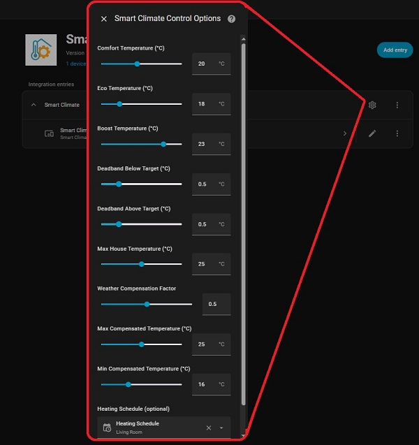

# Smart Climate Control for Home Assistant

[](https://github.com/hacs/integration)
[](https://github.com/smartthings54/smart-climate-control/releases)
[](LICENSE)

This project started out as a Node-RED flow but has been rebuilt as a native Home Assistant integration.
The goal is to make climate management simpler and more flexible instead of editing flows, 
configuration can now be adjusted directly from the Home Assistant control panel.

The majority of the code was generated with the help of AI, with my role focused on integration, testing, and making it work within my setup.

## 🌟 Features

- **🌡️ Intelligent Temperature Control**
  - **Heating & Cooling Modes**: Full-featured heating with simplified cooling support
  - Deadband control to prevent cycling
  - Weather compensation for cold days (heating mode only, when outside sensor configured)
  - Multiple temperature presets for heating (Comfort, Eco, Boost)
  - Single temperature preset for cooling (simplified mode)
  - Adjustable temperature settings via number entities
  
- **🏠 Smart Home Integration**
  - Occupancy-based heating/cooling via presence tracker
  - Sleep detection for automatic eco mode (heating only, requires bed sensor)
  - Door/window monitoring to prevent energy waste (both modes)
  - Schedule integration with mode support (heating: comfort/eco/boost/off)

- **Heat Pump Contact Sensor**: Binary sensor to verify heat pump is actually running (recommended for IR/SmartIR controlled devices)
  
- **⚡ Energy Optimization**
  - House average temperature limits (heating mode only)
  - Configurable deadband ranges above/below target (both modes)
  - Maximum/minimum compensation temperature limits (heating mode only)
  
- **📊 Comprehensive Monitoring**
  - Real-time status display via sensors
  - Debug information showing current logic
  - Climate entity with proper HVAC modes (OFF/HEAT/COOL/AUTO)
  - Multiple switch controls for force modes

## 🔥❄️ Heating vs Cooling Modes

### Heating Mode (HEAT/AUTO)
Full-featured intelligent heating with:
- Multiple temperature presets (Comfort, Eco, Boost)
- Schedule integration
- Sleep detection (automatic eco mode)
- Weather compensation for cold days
- House average temperature limits
- Force Comfort and Force Eco modes

### Cooling Mode (COOL)
Simplified cooling with:
- Single temperature target (default 22°C, adjustable 18-28°C)
- Door sensor monitoring
- Presence detection
- Inverted deadband control (cool when hot, stop when cool)
- Force Cooling mode switch for easy activation

**Why simplified cooling?** Most cooling needs are straightforward - just maintain a comfortable temperature when it's hot. The advanced features like schedules and sleep modes are more useful for heating optimization.

## 📋 Prerequisites

- Home Assistant 2024.1.0 or newer
- HACS (Home Assistant Community Store) installed
- The following entities in your Home Assistant:
  - A climate entity (heat pump/thermostat) that supports both heating and cooling
  - Room temperature sensor
  - Outside temperature sensor (optional but recommended for weather compensation in heating mode)

## 🚀 Installation

### Via HACS (Recommended)

1. Open HACS in your Home Assistant instance
2. Click on "Integrations"
3. Click the three dots menu in the top right
4. Select "Custom repositories"
5. Add this repository URL: `https://github.com/smartthings54/smart-climate-control`
6. Select "Integration" as the category
7. Click "Add"
8. Search for "Smart Climate Control"
9. Click "Download"
10. Restart Home Assistant

### Manual Installation

1. Download the latest release from GitHub
2. Extract the `smart_climate_control` folder
3. Copy it to your `custom_components` directory:
   ```
   config/custom_components/smart_climate_control/
   ```
4. Restart Home Assistant

## ⚙️ Configuration

### Initial Setup

1. Go to **Settings** → **Devices & Services**
2. Click **+ Add Integration**
3. Search for **Smart Climate Control**
4. Follow the setup wizard:
   - Select your heat pump/climate entity to control
   - Choose temperature sensors
   - Configure optional features

### Configuration Options

#### Required Entities
- **Heat Pump Entity**: Your climate device to control (must support both heat and cool)
- **Room Temperature Sensor**: The room you want to control

#### Optional Entities
- **Outside Temperature Sensor**: For weather compensation (heating mode only)
- **Average House Temperature**: For whole-house temperature monitoring (heating mode only)
- **Door Sensor**: Disable heating/cooling when door is open for >70 seconds
- **Presence Tracker**: For occupancy-based control (person/device_tracker/group/sensor/input_boolean)
- **Heating Schedule**: Schedule entity for automatic mode changes (heating mode only)
- **Bed Sensor**: Binary sensor or input_boolean for sleep detection (heating mode only)

#### Temperature Settings (Configurable via Integration Options)
- **Comfort Temperature**: Default 20°C (16-25°C range) - Heating mode
- **Eco Temperature**: Default 18°C (16-25°C range) - Heating mode
- **Boost Temperature**: Default 23°C (16-25°C range) - Heating mode
- **Cooling Temperature**: Default 22°C (18-28°C range) - Cooling mode

#### Advanced Settings (Configurable via Integration Options)
- **Deadband Below**: 0.5°C (0.1-2°C range) - turn ON when temp drops this much below target
- **Deadband Above**: 0.5°C (0.1-2°C range) - turn OFF when temp rises this much above target
- **Max House Temperature**: 25°C (20-30°C range) - safety shutoff limit (heating mode only)
- **Weather Compensation Factor**: 0.5 (0-1 range) - how much to boost temp based on outside temp (heating mode only)
- **Max Compensated Temperature**: 25°C (20-30°C range) - (heating mode only)
- **Min Compensated Temperature**: 16°C (14-20°C range) - (heating mode only)

## 🎛️ Created Entities

### Climate Entity
- **`climate.YOUR_CLIMATE_ENTITY`** - Main climate control with OFF/HEAT/COOL/AUTO modes

### Switches  
- **`switch.smart_climate_climate_management`** - Master enable/disable for smart control
- **`switch.smart_climate_force_comfort_mode`** - Force comfort temperature (heating mode)
- **`switch.smart_climate_force_eco_mode`** - Force eco temperature (heating mode)
- **`switch.smart_climate_force_cooling_mode`** - Force cooling mode (NEW!)

### Sensors
- **`sensor.smart_climate_status`** - Current system status and debug info
- **`sensor.smart_climate_mode`** - Current active mode (Comfort/Eco/Force Comfort/Cooling/etc)
- **`sensor.smart_climate_target`** - Target temperature being used

### Number Entities (for adjusting temperatures)
- **`number.smart_climate_boost_temperature`** - Adjust boost temperature
- **`number.smart_climate_comfort_temperature`** - Adjust comfort temperature  
- **`number.smart_climate_eco_temperature`** - Adjust eco temperature
- **`number.smart_climate_cooling_temperature`** - Adjust cooling temperature (NEW!)

## 📱 Dashboard Cards

### Basic Status Card
```yaml
type: entities
entities:
  - entity: climate.YOUR_CLIMATE_ENTITY
  - entity: sensor.smart_climate_status
  - entity: sensor.smart_climate_mode
  - entity: sensor.smart_climate_target
```

### Control Card
```yaml
type: vertical-stack
cards:
  - type: thermostat
    entity: climate.YOUR_CLIMATE_ENTITY
  - type: entities
    entities:
      - entity: switch.smart_climate_climate_management
      - entity: switch.smart_climate_force_comfort_mode
      - entity: switch.smart_climate_force_eco_mode
      - entity: switch.smart_climate_force_cooling_mode
```

### Temperature Settings Card
```yaml
type: entities
entities:
  - entity: number.smart_climate_boost_temperature
  - entity: number.smart_climate_comfort_temperature
  - entity: number.smart_climate_eco_temperature
  - entity: number.smart_climate_cooling_temperature
```

### Debug / Overview
```yaml
type: markdown
content: >
  ### Smart Climate Overview  

  
      
    
  
       

  Smart Climate Control is 🟢 enabled🔴 disabled and set to {{ mode }} (❄️ Cooling🔥 Heating). 
  
  Room temperature is **{{ room }}°C** with a target of **{{ target }}°C**, with a deadband of **{{ deadband_below
  }}°C** below and **{{ deadband_above }}°C** above target.

  
  Resulting in **ON** at **{{ (target - deadband_below)|round(1) }}°C** and **OFF** at **{{ (target
  + deadband_above)|round(1) }}°C**  

   Because outside is **{{ outside }}°C**, compensation
  adds **+{{ comp_adjust|round(1) }}°C**.   ✅ Adjusted target is now **{{
  adjusted_target }}°C**.    No weather compensation applied outside
  is **{{ outside }}°C**
  
  **COOLING MODE**: ON when >= **{{ (target + deadband_above)|round(1) }}°C**, OFF when <= **{{ (target - deadband_below)|round(1) }}°C**
  

  **Settings:**   

  - Comfort: {{ states('number.smart_climate_comfort_temperature') }}°C   

  - Eco: {{ states('number.smart_climate_eco_temperature') }}°C   

  - Boost: {{ states('number.smart_climate_boost_temperature') }}°C   

  - Cooling: {{ states('number.smart_climate_cooling_temperature') }}°C

  

  - Max House Temp: {{ max_house_temp }}°C   

  - Comp Range: {{ min_comp_temp }}°C → {{ max_comp_temp }}°C
  

  **Switches:**   

  - Climate Management: {{ states('switch.smart_climate_climate_management')
  }}   

  - Force Eco Mode: {{ states('switch.smart_climate_force_eco_mode') }}   

  - Force Comfort Mode: {{ states('switch.smart_climate_force_comfort_mode')
  }}  

  - Force Cooling Mode: {{ states('switch.smart_climate_force_cooling_mode')
  }}

  **Conditions:**   

  - Outside Temp: {{ outside }}°C   

  - Schedule State: {{ states('schedule.heating') }}   

  - Presence: {{ states('sensor.combined_tracker') }}  

  
     

  🔥 **System should be HEATING** (room is {{ (target - room)|round(1) }}°C
  below target)    ❄️ **System
  should be OFF** (room is {{ (room - target)|round(1) }}°C above target)    

  ⚖️ **System is in DEADBAND zone** (holding state)   
  
    

  ❄️ **System should be COOLING** (room is {{ (room - target)|round(1) }}°C
  above target)    🔥 **System
  should be OFF** (room is {{ (target - room)|round(1) }}°C below target)   

  ⚖️ **System is in DEADBAND zone** (holding state)   
  
```


**📊 Install Settings**

If you wish to adjust the settings used at install:
   - Min & Max Temperatures
   - Deadband Highs & Lows
   - Weather Compensation Factor
   - Schedule Used

Clicking on the gear icon will reveal all needed options.



## 🎯 How It Works

The system operates on a 60-second cycle:

1. **Data Collection**: Gathers all sensor readings
2. **Mode Detection**: Determines if in heating or cooling mode
3. **Decision Logic**:

   **Heating Mode (HEAT/AUTO):**
   - System enabled?
   - Force modes active? (Force Comfort > Force Eco)
   - Anyone home? (if presence tracker configured)
   - Door open too long? (>70 seconds)
   - House too hot? (average temperature limit)
   - Room temperature vs target with deadband
   - Weather compensation adjustment
   
   **Cooling Mode (COOL):**
   - System enabled?
   - Anyone home? (if presence tracker configured)
   - Door open too long? (>70 seconds)
   - Room temperature vs target with inverted deadband

4. **Action Execution**: Controls heat pump accordingly

### Deadband Logic

**Heating Mode:**
- Turn ON when: Room temp ≤ (Target - Deadband Below)
- Turn OFF when: Room temp ≥ (Target + Deadband Above)

**Cooling Mode (Inverted):**
- Turn ON when: Room temp ≥ (Target + Deadband Above)
- Turn OFF when: Room temp ≤ (Target - Deadband Below)

### Safety Features

- Maximum house temperature limit (heating mode only)
- Temperature range limits (16-25°C for heating, 18-28°C for cooling)
- Automatic shutoff when doors open >70 seconds (both modes)
- Sensor failure fallbacks (outside temp defaults to 5°C)

## 🐛 Troubleshooting

### System Not Heating/Cooling
1. Check if **Climate Management** switch is ON
2. Verify someone is home (if using presence tracker)
3. Check door sensors aren't triggered  
4. Review the **Status** sensor for details
5. Check if wrong mode is active (heating vs cooling)
6. Verify you're not in the deadband zone

### Temperature Not Changing
1. Check if **Force modes** are overriding schedule (heating only)
2. Verify you're in the deadband zone (check Status sensor)
3. Check temperature settings via Number entities
4. Review schedule entity state (if configured, heating only)
5. Ensure correct mode is selected (HEAT/COOL/AUTO)

### Cooling Not Working
1. Ensure **Force Cooling Mode** switch is ON, or climate entity is set to COOL
2. Check that your heat pump supports cooling mode
3. Verify room temperature is above the cooling target + deadband
4. Check Status sensor for debug information

### Controls Not Working
1. Make sure you're using the climate entity or switches, not calling services on the controlled heat pump directly
2. Check Home Assistant logs for "Climate:" or "Smart Climate:" debug messages
3. Verify the integration is properly controlling the heat pump entity

## 💡 Usage Tips

### Summer/Winter Mode Switching

**Automatic with Automation:**

Create two separate automations for automatic seasonal switching. Replace `sensor.outside_temperature` with your actual outside temperature sensor.

**Automation 1: Switch to Cooling in Summer**
```yaml
alias: "Switch to Cooling in Summer"
description: "Automatically enable cooling mode when outside temperature is high"
trigger:
  - platform: numeric_state
    entity_id: sensor.outside_temperature
    above: 25
    for:
      hours: 2
action:
  - service: switch.turn_on
    target:
      entity_id: switch.smart_climate_force_cooling_mode
mode: single
```

**Automation 2: Switch to Heating in Winter**
```yaml
alias: "Switch to Heating in Winter"
description: "Automatically disable cooling mode when outside temperature drops"
trigger:
  - platform: numeric_state
    entity_id: sensor.outside_temperature
    below: 15
    for:
      hours: 2
action:
  - service: switch.turn_off
    target:
      entity_id: switch.smart_climate_force_cooling_mode
mode: single
```

**Manual Control:**
- Turn on `switch.smart_climate_force_cooling_mode` for summer
- Turn off `switch.smart_climate_force_cooling_mode` for winter (returns to auto heating)

## 📝 Support

- **Issues**: [GitHub Issues](https://github.com/smartthings54/smart-climate-control/issues)
- **Discussions**: [GitHub Discussions](https://github.com/smartthings54/smart-climate-control/discussions)
- **Updates**: Watch the repository for updates

## 📄 License

This project is licensed under the MIT License - see the [LICENSE](LICENSE) file for details.

## 🔄 Changelog

### Version 1.1.0
- **NEW**: Cooling mode support with Force Cooling switch
- Added cooling temperature number entity (18-28°C range)
- Inverted deadband logic for cooling
- Climate entity now supports OFF/HEAT/COOL/AUTO modes
- Updated debug display to show current mode
- Cooling mode uses simplified logic (doors and presence only)

### Version 1.0.0
- Initial release
- Core climate control functionality
- Weather compensation
- Sleep detection  
- Door monitoring
- HACS compatibility
- Configurable deadband and temperature settings
- Force mode switches
- Schedule entity support with options configuration
