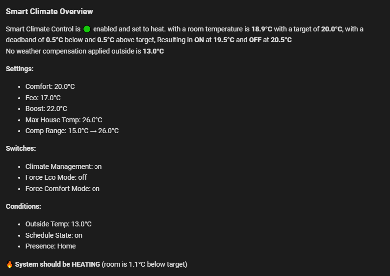

# Smart Climate Control for Home Assistant

[](https://github.com/hacs/integration)
[](https://github.com/smartthings54/smart-climate-control/releases)
[](LICENSE)

A sophisticated climate control system for Home Assistant that provides intelligent heating management with features like weather compensation, sleep detection, occupancy tracking, and energy optimization.

## 🌟 Features

- **🌡️ Intelligent Temperature Control**
  - Deadband control to prevent cycling
  - Weather compensation for cold days
  - Multiple temperature presets (Comfort, Eco, Boost)
  
- **🏠 Smart Home Integration**
  - Occupancy-based heating
  - Sleep detection for automatic eco mode
  - Door/window monitoring to prevent energy waste
  
- **⚡ Energy Optimization**
  - House average temperature limits
  - Schedule integration
  - Automatic daily temperature reset
  
- **📊 Comprehensive Monitoring**
  - Real-time status display
  - Debug information
  - Multiple sensor outputs

## 📋 Prerequisites

- Home Assistant 2024.1.0 or newer
- HACS (Home Assistant Community Store) installed
- The following entities in your Home Assistant:
  - A climate entity (heat pump/thermostat)
  - Room temperature sensor
  - Outside temperature sensor

## 🚀 Installation

### Via HACS (Recommended)

1. Open HACS in your Home Assistant instance
2. Click on "Integrations"
3. Click the three dots menu in the top right
4. Select "Custom repositories"
5. Add this repository URL: `https://github.com/smartthings54/smart-climate-control`
6. Select "Integration" as the category
7. Click "Add"
8. Search for "Smart Climate Control"
9. Click "Download"
10. Restart Home Assistant

### Manual Installation

1. Download the latest release from GitHub
2. Extract the `smart_climate_control` folder
3. Copy it to your `custom_components` directory:
   ```
   config/custom_components/smart_climate_control/
   ```
4. Restart Home Assistant

## ⚙️ Configuration

### Initial Setup

1. Go to **Settings** → **Devices & Services**
2. Click **+ Add Integration**
3. Search for **Smart Climate Control**
4. Follow the setup wizard:
   - Select your heat pump/climate entity
   - Choose temperature sensors
   - Configure optional features

### Configuration Options

#### Required Entities
- **Heat Pump Entity**: Your climate device to control
- **Room Temperature Sensor**: The room you want to control
- **Outside Temperature Sensor**: For weather compensation

#### Optional Entities
- **Average House Temperature**: For whole-house monitoring
- **Door Sensor**: Disable heating when door is open
- **Bed Sensors**: For automatic sleep detection
- **Presence Tracker**: For occupancy-based control

#### Temperature Settings
- **Comfort Temperature**: Default 19°C (16-25°C range)
- **Eco Temperature**: Default 17°C (16-25°C range)
- **Boost Temperature**: Default 21°C (16-25°C range)

#### Advanced Settings
- **Deadband Below**: 0.5°C (0.1-2°C range)
- **Deadband Above**: 0.5°C (0.1-2°C range)
- **Max House Temperature**: 26°C (20-30°C range)
- **Weather Compensation Factor**: 0.5 (0-1 range)

## 📱 Dashboard Cards

### Basic Status Card
```yaml
type: entities
entities:
  - entity: climate.YOUR_ENTITY
  - entity: sensor.smart_climate_status
  - entity: sensor.smart_climate_mode
  - entity: sensor.smart_climate_target
```

### Control Card
```yaml
type: vertical-stack
cards:
  - type: thermostat
    entity: climate.YOUR_ENTITY
  - type: entities
    entities:
      - entity: switch.smart_climate_climate_management
      - entity: switch.smart_climate_force_comfort_mode
      - entity: switch.smart_climate_force_eco_mode
```

### Temperature Settings Card
```yaml
type: entities
entities:
  - entity: number.smart_climate_boost_temperature
  - entity: number.smart_climate_comfort_temperature
  - entity: number.smart_climate_eco_temperature
```

### DeBug / OverView
```yaml
type: markdown
content: >
  ### Smart Climate Overview  

  
      
   
       

  Smart Climate Control is 🟢 enabled🔴 disabled and set to {{ mode }}. with a room temperature is **{{ room }}°C**
  with a target of **{{ target }}°C**, with a deadband of **{{ deadband_below
  }}°C** below and **{{ deadband_above }}°C** above target, Resulting in **ON**
  at **{{ (target - deadband_below)|round(1) }}°C** and **OFF** at **{{ (target
  + deadband_above)|round(1) }}°C**  

   Because outside is **{{ outside }}°C**, compensation
  adds **+{{ comp_adjust|round(1) }}°C**.   ✅ Adjusted target is now **{{
  adjusted_target }}°C**.    No weather compensation applied outside
  is **{{ outside }}°C**


  **Settings:**   

  - Comfort: {{ states('number.smart_climate_comfort_temperature') }}°C   

  - Eco: {{ states('number.smart_climate_eco_temperature') }}°C   

  - Boost: {{ states('number.smart_climate_boost_temperature') }}°C   

  - Max House Temp: {{ max_house_temp }}°C   

  - Comp Range: {{ min_comp_temp }}°C → {{ max_comp_temp }}°C


  **Switches:**   

  - Climate Management: {{ states('switch.smart_climate_climate_management')
  }}   

  - Force Eco Mode: {{ states('switch.smart_climate_force_eco_mode') }}   

  - Force Comfort Mode: {{ states('switch.smart_climate_force_comfort_mode')
  }}  


  **Conditions:**   

  - Outside Temp: {{ outside }}°C   

  - Schedule State: {{ states('schedule.heating') }}   

  - Presence: {{ states('sensor.combined_tracker') }}  

   

  🔥 **System should be HEATING** (room is {{ (target - room)|round(1) }}°C
  below target)    ❄️ **System
  should be OFF** (room is {{ (room - target)|round(1) }}°C above target)    

  ⚖️ **System is in DEADBAND zone** (holding state)   

```



## 🔧 Services

### smart_climate_control.force_eco
Force the system into eco mode.

```yaml
service: smart_climate_control.force_eco
data:
  enable: true  # or false to disable
```

### switch.smart_climate_force_comfort_mode
Force the system into comfort mode.

```yaml
service: switch.smart_climate_force_comfort_mode
data:
  enable: true  # or false to disable
```

### smart_climate_control.reset_temperatures
Reset all temperature settings to defaults.

```yaml
service: smart_climate_control.reset_temperatures
```

## 🤖 Automations

### Example: Schedule-Based Mode Changes
```yaml
automation:
  - alias: "Morning Comfort Mode"
    trigger:
      - platform: time
        at: "06:00:00"
    action:
      - service: switch.turn_off
        target:
          entity_id: switch.smart_climate_force_eco_mode

  - alias: "Night Eco Mode"
    trigger:
      - platform: time
        at: "22:00:00"
    action:
      - service: switch.turn_on
        target:
          entity_id: switch.smart_climate_force_eco_mode
```

### Example: Away Mode
```yaml
automation:
  - alias: "Away Mode"
    trigger:
      - platform: state
        entity_id: person.YOUR_ENTITY
        to: "not_home"
        for: "00:10:00"
    action:
      - service: switch.turn_off
        target:
          entity_id: switch.smart_climate_climate_management
```

### Example: Force Comfort When Cold Outside
```yaml
automation:
  - alias: "Force Comfort When Very Cold"
    trigger:
      - platform: numeric_state
        entity_id: sensor.outside_temperature
        below: -5
    action:
      - service: switch.smart_climate_force_comfort_mode
        data:
          enable: true
```

### Example: Reset to Auto Mode
```yaml
automation:
  - alias: "Reset to Auto Mode"
    trigger:
      - platform: time
        at: "07:00:00"
    action:
      - service: switch.turn_off
        target:
          entity_id: switch.smart_climate_force_comfort_mode
      - service: switch.turn_off
        target:
          entity_id: switch.smart_climate_force_eco_mode
```

## 🎯 How It Works

The system operates on a 60-second cycle:

1. **Data Collection**: Gathers all sensor readings
2. **Decision Logic**: Evaluates conditions in priority order:
   - System enabled?
   - Manual override active?
   - Anyone home?
   - Door open too long?
   - House too hot?
   - Room temperature vs target
3. **Weather Compensation**: Adjusts for outdoor temperature
4. **Action Execution**: Controls heat pump accordingly

### Temperature Control Logic

- **Heating ON**: When room temp < (target - deadband_below)
- **Heating OFF**: When room temp > (target + deadband_above)
- **Maintain State**: When in deadband zone

### Safety Features

- Maximum house temperature limit (default 26°C)
- Temperature range limits (16-25°C)
- Automatic shutoff when doors open
- Sensor failure fallbacks

## 🐛 Troubleshooting

### System Not Heating
1. Check if Climate Management switch is ON
2. Verify someone is home (if using presence)
3. Check door sensors aren't triggered
4. Review the status sensor for details

### Temperature Not Changing
1. Check if Manual Override is OFF
2. Verify Force Eco Mode setting
3. Check if in deadband zone
4. Review temperature settings

### Sensor Issues
- Invalid sensors default to safe values
- Outside temp defaults to 5°C if unavailable
- Check logs for sensor warnings

## 📝 Support

- **Issues**: [GitHub Issues](https://github.com/smartthings54/smart-climate-control/issues)
- **Discussions**: [GitHub Discussions](https://github.com/smartthings54/smart-climate-control/discussions)
- **Updates**: Watch the repository for updates

## 📄 License

This project is licensed under the MIT License - see the [LICENSE](LICENSE) file for details.

## 🙏 Acknowledgments

- Based on advanced Node-RED climate control logic
- Inspired by energy-efficient heating practices
- Community feedback and contributions

## 🔄 Changelog

### Version 1.0.0
- Initial release
- Core climate control functionality
- Weather compensation
- Sleep detection
- Door monitoring

- HACS compatibility
- 

